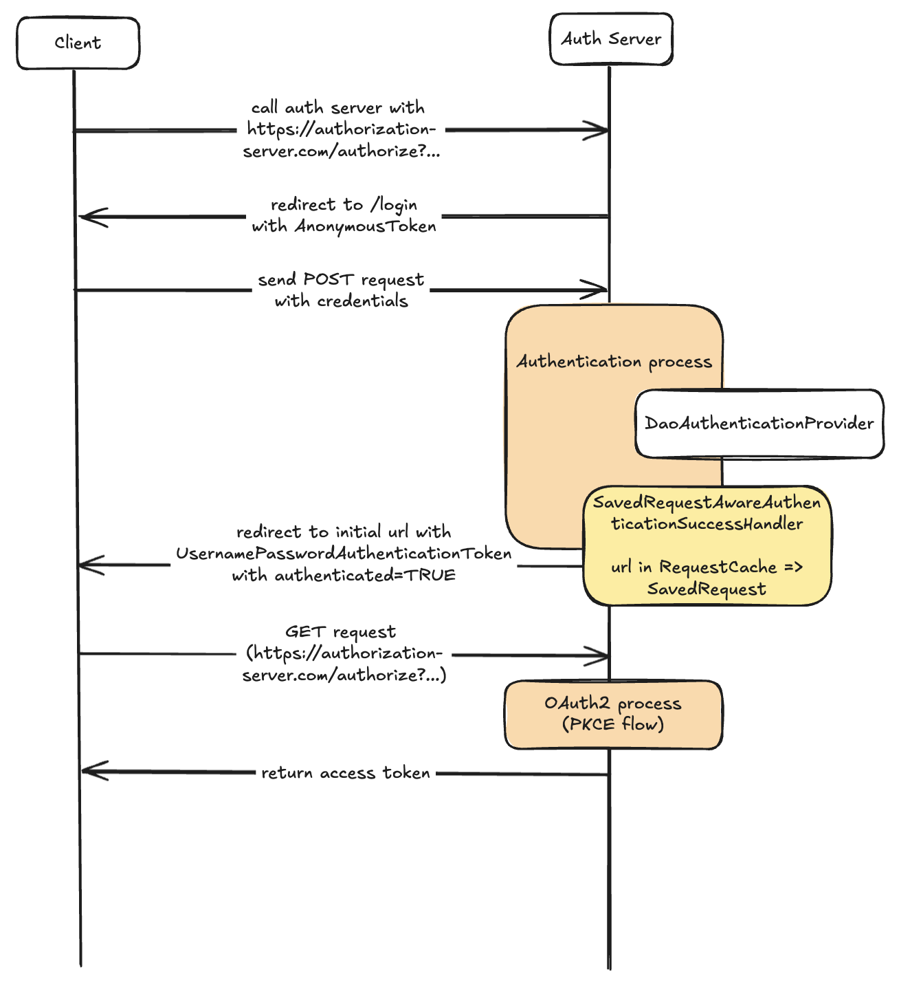
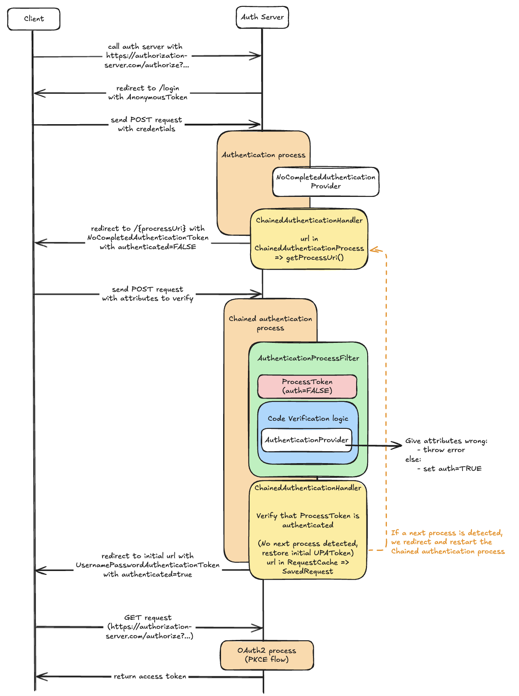
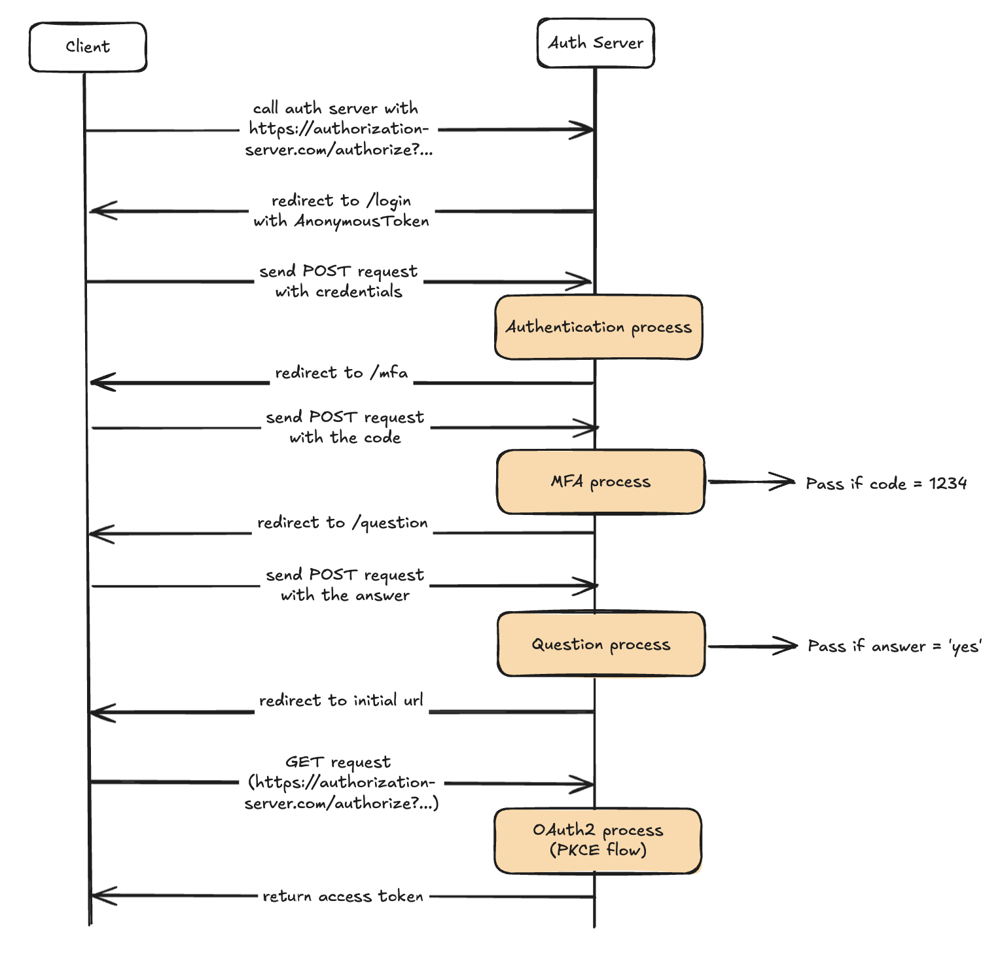

## Explain the project and the research

### Introduction
I started this project because there was no clear solution for implementing MFA in a Spring Authorization Server.
Spring does not provide a ready-to-use solution, and the explanations available online are not very explicit.

After analyzing the Spring Security (and the Spring Authorization Server) source code, I designed a customized solution.
Before going into detail, here's a simplified diagram showing the classic authentication flow without MFA:



### Existing solutions
The majority of existing solutions available on github propose redirecting to an MFA process from a success handler
after authentication, without touching the UsernamePasswordAuthenticationToken.
However, the user is considered authenticated even before the MFA is validated, which presents security risks
(see example [here](https://github.com/spring-projects/spring-security-samples/blob/main/servlet/spring-boot/java/authentication/username-password/mfa)).

### Proposed solution
The proposed solution is different. It is based on the following principles:

1. Unauthenticated proxy token on the `UsernamePasswordAuthenticationToken`


During the entire process, the user is **never considered authenticated**. Instead, a proxy, called `NoCompletedAuthenticationToken`,
is used to represent an “unauthenticated” state. This proxy is stored in the `SecurityContext` until the process is completed.
This prevents any steps from being accidentally bypassed.

2. Use of a dedicated filter

A security filter intercepts the request (e.g. to validate an OTP code) and starts the logic process. This approach avoids the need for @PostMapping,
aligning the solution with Spring Security and Spring Authorization Server practices.

3. Modular and configurable system

The system is based on classes and configuration designed to facilitate the creation and management of MFA processes, making implementation cleaner, faster and more secure.
The implementation is explained in more detail in this [part](#implement-section).

Here's a simplified diagram showing the authentication flow with MFA:



### Solution explanation
As you can see, the beginning of the flow is identical to the classic flow, but the steps are modified starting from the `DaoAuthenticationProvider`.

1. The `DaoAuthenticationProvider` provided as standard by Spring Security is replaced by `NoCompletedAuthenticationProvider`.
   This provider is a proxy that returns a `NoCompletedAuthenticationToken` while retaining a reference to the initial `UsernamePasswordAuthenticationToken`.

2. The default success handler (`SavedRequestAwareAuthenticationSuccessHandler`) is replaced by `NoCompletedAuthenticationSuccessHandler`.
   It determines the next process to be executed and chains together the necessary steps until the user is fully authenticated.
   I'll go into more detail on this process below.

3. A unique filter is linked to the process. It captures the user request and launches the appropriate process.
   Next, the process' AuthenticationProvider is called to check the attributes provided by the user.
   - If correct, the process continues by setting the process token (e.g. `MFAAuthenticationToken`) to authenticated, otherwise an exception is raised.

4. If a successor process is identified, start the process again from step 2.
   Otherwise, continue by restoring the initial `UsernamePasswordAuthenticationToken` and redirecting to the OAuth2 process.

#### Step 2 details
To go into more detail about step 2, the chain of processes works as follows:

From the current Authentication (the token), we identify if a process can take over from the current one.
If so, we check that the user is compatible with the process. The user is then redirected to the process and `NoCompletedAuthenticationToken` is updated to store the process.
If no process is identified, the user is redirected to the OAuth2 process, restoring the initial authentication, the `UsernamePasswordAuthenticationToken`.


#### Security
To prevent the user from skipping a step in the process, the `NoCompletedAuthenticationToken` keeps a reference to the current process.
A filter systematically checks this reference and redirects the user to the correct process if he tries to bypass one.
In addition, before any processing of attributes submitted by the user, this **same security is performed**.

### Conclusion
Finally, this solution makes it possible to manage complex sequences quickly, cleanly and securely. For example, in a scenario including :
- A step to force the user to activate double authentication (if not enabled).
- A step to verify the code provided.
- A step to force acceptance of new terms and conditions.

### Solution demonstration

In the case of this demonstration (this github repo), the following diagram summarizes the processes implemented.



## Does the solution work with an classic Spring Security application without Spring Authorization Server?

The answer is yes! Since Spring Authorization Server is based on Spring Security and the solution is implemented before the OAuth2 process,
it can be fully implemented in a regular Spring Security project.

## How to implement a new MFA process? <a id="implement-section"></a>

In this demo, there are already 2 examples(MFAAuthenticationProcess and QuestionAuthenticationProcess), but here's how to add a new process:

### Step 1: Create a new process
```java
public class YourProcess implements ChainedAuthenticationProcess {

    @Override
    public Class<? extends AbstractAuthenticationProcessFilter> getFilterClass() {
        return YourProcessFilter.class; // see step 3
    }

    @Override
    public boolean needToProcess(HttpServletRequest request, HttpServletResponse response, Authentication authentication, SavedRequest savedRequest) throws ServletException, IOException {
        // Here is an example, you can implement your own logic
        User user = (User) authentication.getPrincipal();
        return user.isAccountNonExpired() && user.isEnabled();
    }

    @Override
    public boolean isTheNext(Authentication authentication) {
        /*
        This method determines whether YourProcess should be launched or not. This method manages the chain mechanics. 
        NoCompletedAuthenticationToken is the token returned by the login operation. 
        So this process will be executed just after /login. If we wanted this process to be executed after another, 
        we would have had to set the token of that process (e.g. in QuestionAuthenticationProcess).
         */
        return authentication instanceof NoCompletedAuthenticationToken;
    }

    @Override
    public String getProcessUri() {
        return "/your-process";
    }

    @Override
    public String getProcessQuery(HttpServletRequest request, HttpServletResponse response, Authentication authentication, SavedRequest savedRequest) {
        return null;
    }
}
```

### Step 2: Create the process token
```java
public class YourProcessToken extends AbstractProcessToken {

    // Add your attributes here, for example:
    @Getter
    private final String code;

    public YourProcessToken(Object principal, Authentication linkedAuthentication, String code) {
        super(null, principal, linkedAuthentication);
        this.code = code;
        super.setAuthenticated(false); // to be sure that the token is not authenticated
    }
}
```

### Step 3: Create the process filter
```java
public class YourProcessFilter extends AbstractAuthenticationProcessFilter {

   private static final AntPathRequestMatcher DEFAULT_ANT_PATH_REQUEST_MATCHER = new AntPathRequestMatcher("/your-process", "POST");


   public YourProcessFilter(AuthenticationManager authenticationManager, ChainedAuthenticationHandler chainedAuthenticationHandler) {
      super(DEFAULT_ANT_PATH_REQUEST_MATCHER, authenticationManager, chainedAuthenticationHandler);

      // you can implement your own logic
      setAuthenticationFailureHandler(new SimpleUrlAuthenticationFailureHandler("/your-process?error"));
   }

   @Override
   public Authentication authenticationProcess(HttpServletRequest request, HttpServletResponse response) throws AuthenticationException {
      // implement your own logic, for example get the code to verify from the request (e.g. MFAAuthenticationFilter)
      [...]

      Authentication existingAuth = SecurityContextHolder.getContext().getAuthentication();

      YourProcessToken token = new YourProcessToken(existingAuth.getPrincipal(), existingAuth, [...]);
      token.setDetails(this.authenticationDetailsSource.buildDetails(request));

      return this.getAuthenticationManager().authenticate(token);
   }

   @Override
   public String getHttpMethod() {
      return "POST";
   }
}
```

### Step 4: Create the AuthenticationProvider for the process
```java
public class YourProcessAuthenticationTokenProvider implements AuthenticationProvider {

    @Override
    public Authentication authenticate(Authentication authentication) throws AuthenticationException {
       YourProcessToken token = (YourProcessToken) authentication;

        // Your own verification, for example: check if the code is correct
        if("1234".equals(token.getCode())) {
            authentication.setAuthenticated(true); // IMPORTANT: set the token as authenticated
            return authentication;
        }

        throw new BadCredentialsException("Invalid");
    }

    @Override
    public boolean supports(Class<?> authentication) {
        return YourProcess.class.isAssignableFrom(authentication);
    }
}
```

### Step 5: Create the controller with thymeleaf
Paste you html file in `src/main/resources/templates`.

```java
@Controller
public class YourProcessController {

    @GetMapping("/your-process")
    public String authenticator() {
        return "your-process";
    }
}
```

### Step 6: Add the process and the filter to the configuration
```java
@Bean
@Order(2)
public SecurityFilterChain defaultSecurityFilterChain(HttpSecurity http, AuthenticationManager authenticationManager)
        throws Exception {
   // define the chained authentication process and create the handler to manage it
   List<ChainedAuthenticationProcess> processes = List.of([...], new YourProcess());
   ChainedAuthenticationHandler chainedAuthenticationHandler = new ChainedAuthenticationHandler(processes);

   http
           .authorizeHttpRequests((authorize) -> authorize
                   .requestMatchers([...], "/your-process").hasRole("NO_COMPLETE_AUTH") // all the route of the chained process
                   .anyRequest().authenticated()
           )
           [...]// Some configs..
           // All your filter here, you can change UsernamePasswordAuthenticationFilter by another process filter
           .addFilterAfter(new YourProcessFilter(authenticationManager, chainedAuthenticationHandler),
                   UsernamePasswordAuthenticationFilter.class);

   return http.build();
}
```

### Step 7: Add the provider to the configuration
```java
@Bean
public AuthenticationManager authenticationManager() {
   // the authentication manager is the core of the chained authentication process, it will be only use in that context.
   return new ProviderManager(List.of([...], new YourProcessAuthenticationTokenProvider()));
}
```