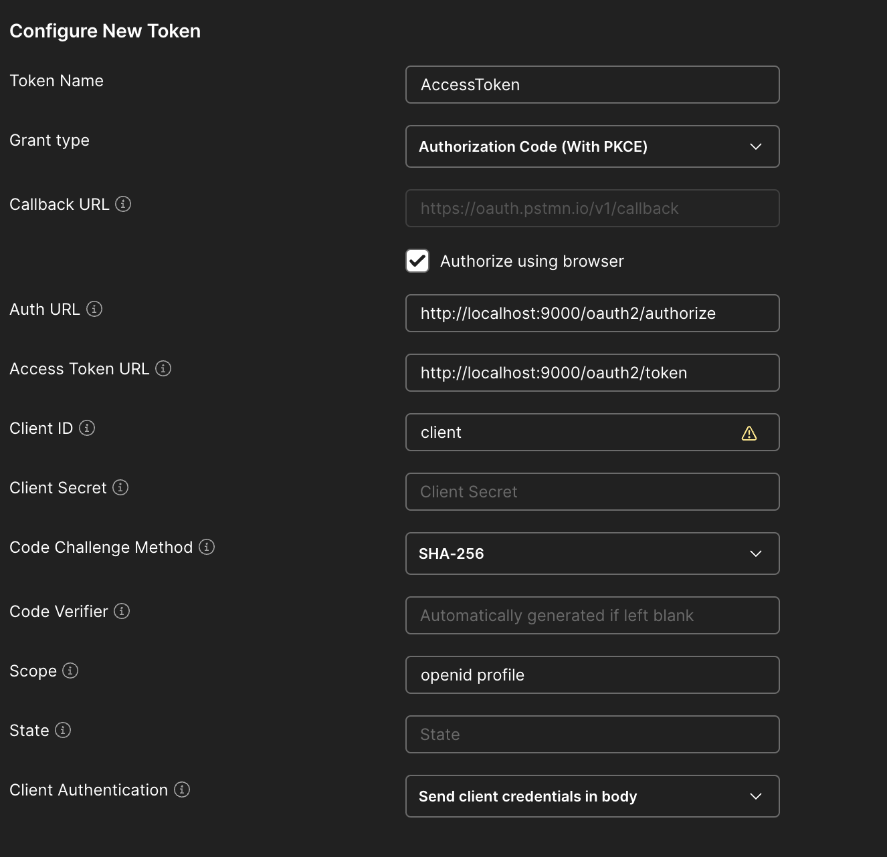

# MFA in Spring Authorization Server

This project is a simple example of how to implement MFA in a Spring Authorization Server.
If you want to know more about the project, how to implement it and the research, you can read the [PROJECT.md](PROJECT.md) file.

## Does the solution work with an classic Spring Security application without Spring Authorization Server?

The answer is yes! Since Spring Authorization Server is based on Spring Security and the solution is implemented before the OAuth2 process,
it can be fully implemented in a regular Spring Security project.

## How to run the project ?

Else, you can run the project on your own machine. You can use the following command.

```shell
cd mfa-spring-authorization-server
docker build -t mfa-spring-authorization-server:1.0 . && docker run -p 9000:9000 mfa-spring-authorization-server:1.0
```

The server will be available at http://localhost:9000. You can see the configuration here : http://localhost:9000/.well-known/openid-configuration

## How to test it ?

You can test it with Postman. Use the following configuration:



Then, click on the "Get New Access Token" button. You will be redirected to the Authorization Server login page. 
You can use the following credentials: username: `user` and password: `user`.

The verification code is `1234` and the correct answer is `yes`.

## License
THis project is Open Source software released under the [Apache 2.0 license.](https://www.apache.org/licenses/LICENSE-2.0.html)